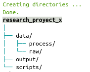
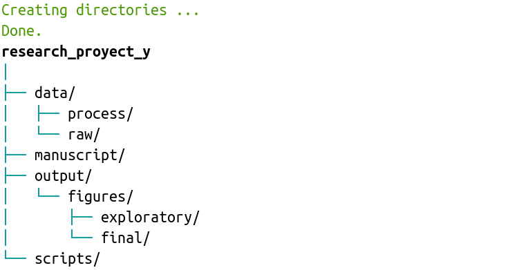
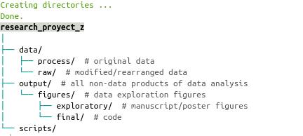

<!-- README.md is generated from README.Rmd. Please edit that file -->

```{r setup, include = FALSE}


knitr::opts_chunk$set(
  collapse = TRUE,
  out.width = "100%"
)
library(sketchy)
```

<!-- [](https://cran.r-project.org/package=sketchy) -->
<!-- [](http://www.r-pkg.org/pkg/sketchy) -->
<!-- [](https://r-pkg.org/pkg/sketchy) -->
[](https://www.tidyverse.org/lifecycle/#experimental)

`sketchy` is intended to facilitate the use of research compendiums for data analysis in the R environment. Standard research compendiums provide a easily recognizable means for organizing digital materials, allowing  other researchers to inspect, reproduce, and build upon that research.

To install the latest developmental version from [github](http://github.com/) you will need the R package [devtools](https://cran.r-project.org/package=devtools):

```{r, eval = FALSE}

# From github
devtools::install_github("maRce10/sketchy")

#load package
library(sketchy)

```


## Default compendium skeletons

The package comes with 2 default compendium skeletons (i.e. folder structures). They can be used with the function `compendium_skeleton()`:

## Basic compendium

```{r, eval = FALSE}

path = tempdir()

compendium_skeleton(name = "research_proyect_x", path = path, format = compendiums$basic$skeleton)

```

```{r echo=FALSE, out.width='22%'}

```

&nbsp; 

(*in these examples compendiums is created in a temporary directory, change 'path' to create it in a different directory*)


## Output/figures

```{r, eval = FALSE}

compendium_skeleton(name = "research_proyect_y", path = path, format = compendiums$output_figures$skeleton)

```

```{r echo=FALSE, out.width='22%'}

```

&nbsp; 

We can also add comments to the folders to explain what kind of files they are supposed to contain: 

```{r, eval = FALSE}

compendium_skeleton(name = "research_proyect_z", path = path, format = compendiums$output_figures$skeleton, 
                    comments = compendiums$output_figures$comments)

```

```{r echo=FALSE, out.width='60%'}

```

&nbsp; 

---

Please cite [sketchy](https://marce10.github.io/sketchy/) as follows:

Araya-Salas, M., Willink, B., Arriaga, A. (2020), *sketchy:research compendiums for data analysis in R*. R package version 1.0.0.


# References

1. Marwick, B., Boettiger, C., & Mullen, L. (2018). *Packaging Data Analytical Work Reproducibly Using R (and Friends)*. American Statistician, 72(1), 80–88.

1. Alston, J., & Rick, J. (2020). *A Beginner’s Guide to Conducting Reproducible Research*. 
